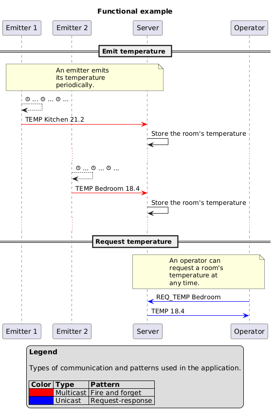
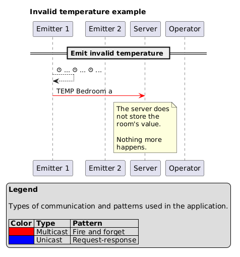
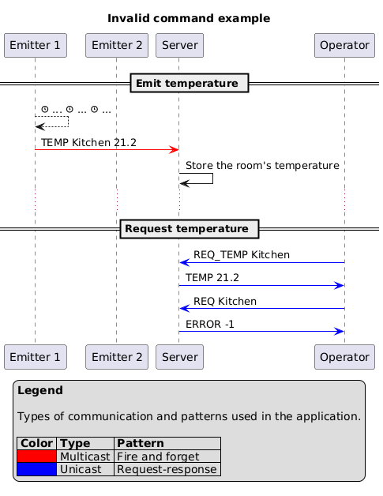

# The _"Temperature monitoring"_ protocol

You are working for an energy company that is interested in monitoring the
temperature of its buildings. The company wants to create a new application
called _"Temperature monitoring"_.

The application is simple: each room (customizable) has a temperature sensor (an
emitter) that emits its own temperature to a receiver (a server).

The server will store the latest temperature of each room.

An operator (client) can connect to the server and request the temperature of a
specific room. The server will respond with the temperature of the room.

Here is **one of the possible results**.

> [!NOTE]
>
> Each person can have a different way to define the protocol. This is one of
> the possible ways to define the protocol. Your might be different and that is
> totally fine. The most important is to define the protocol in a clear and
> explicit way.
>
> The application protocol can be implemented using both TCP and UDP. The choice
> of the transport protocol depends on the requirements of the application. For
> this example, we have decided to use UDP.

## Section 1 - Overview

The _"Temperature monitoring"_ protocol is a communication protocol that allows
a client to request the temperature of a specific room.

The server stores the latest temperature of each room.

The emitter sends the temperature of the room to the server every few seconds.

## Section 2 - Transport protocol

The _"Temperature monitoring"_ protocol is a text transport protocol. It uses
UDP transport protocol as reliability is not a concern for this application.

Every message must be encoded in UTF-8 and delimited by a newline character
(`\n`). The messages are treated as text messages.

The emitters do not have to initiate the communication. They will send the
temperature of the room to the server every few seconds using multicast with the
help of UDP and the fire-and-forget pattern on the port 7337 and multicast group
`230.1.2.3`.

The server must verify that the room number is valid.

If the room number is valid, the server will store the latest temperature of the
room along the room number.

Otherwise, the measurement is not stored and nothing more happens.

The operator must initiate the communication using unicast with the help of UDP
and the request-response pattern on the port 1732.

The operator can request the temperature of a specific room.

The server's role is to verify if the received room is valid (is it a valid
room?) and return the temperature of the room.

On an unknown message, the server must send an error to the client.

## Section 3 - Messages

### Emit temperature

The emitter emits a message to the server, indicating the current temperature of
the room.

#### Request

```text
TEMP <id> <temperature>
```

- `<id>`: the room number
- `<temperature>`: the temperature of the room

#### Response

None.

### Request temperature

The operator sends a message to the server, indicating the room it wants the
temperature of.

#### Request

```text
REQ_TEMP <room>
```

- `<room>`: the room number the client wants the temperature of

#### Response

- `TEMP <temperature>`: the temperature of the room
- `ERROR <code>`: an error occurred during the request. The error code is an
  integer between 1 and 3 inclusive. The error codes are as follow:
  - 1: the room number is invalid
  - 2: the room number is not found
  - 3: the temperature is not available

The 3rd case, albeit rare, can happen if the temperature for an existing room
has not been received yet.

### Invalid message

If the server receives an unknown message from the operator, it must send an
error message to the operator.

#### Response

- `ERROR <code>`: an error occurred while sending the message. The error code is
  an integer between -1 and -1 inclusive. The error code is as follow:
  - -1: invalid message

## Section 4 - Examples

### Functional example



### Invalid temperature example



### Request temperature errors example


### Invalid command example


