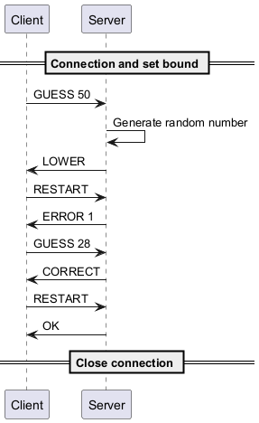

# The guessTheNumber protocol

You are working for a game company that wants to create a new game called _"Guess the number"_.

The game is simple: the server generates a random number between 1 and 100 (customizable).

The client has to guess the number. The server will respond with `HIGHER`, `LOWER` or `CORRECT` depending on the number guessed by the client.

Once the client has guessed the number, the client can ask the server to restart the game with a `RESTART` message or to quit the game.

Here is **one of the possible results**.

> [!NOTE]
>
> Each person can have a different way to define the protocol. This is one of
> the possible ways to define the protocol. Your might be different and that is
> totally fine. The most important is to define the protocol in a clear and
> explicit way.

## Section 1 - Overview

The guessTheNumber protocol is a communication protocol that allows a client to try guessing a number randomly generated by the server.

## Section 2 - Transport protocol
The guessTheNumber protocol is a text transport protocol. It must use the TCP to ensure the reliability of data transmssion. The port it uses has no relevance as long as it's not used by something else.

Every message must be encoded in UTF-8 and delimited by a newline character
(`\n`). The messages are treated as text messages.

The initial connection must be established by the client.

Once the connection is established, the client can send a message to the server indicating the upper bound of the random number. If no upper bound are specified by the client, the default is 100.

The server's role is to verify if the received number is valid (is it a number?) and in between given bounds.

If these conditions are met, the server will compare his generated number and the client's guess and return if the guess is `HIGHER`, `LOWER` or `CORRECT`.

Otherwise, the server sends an error message to the client. The error must specify which condition hasn't been met.

On an unknown message, the server must send an error to the client.

Once the number is guessed, the client can either `RESTART`, which will start the cycle again or `QUIT` which will close the connection.

## Section 3 - Messages

### Connection

The client sends a connection message to the server, indicating the client's id.

#### Request

```text
CONNECT
```

#### Response

- `ACK`: the connection has been successfully established
- `ERROR <code>`: an error occurred during the connection. The error code is an integer between 1 and 1 inclusive. THe error codes are as follows:
    - 1: the client's id is already in use

### Setting the bound

The client sends a message to the server to set the upper bound of the random number.

If this message is omitted and the client starts guessing, the upper bound will be set to 100.

If the message is sent during an active guessing game, an error will be returned.

#### Request

```text
BOUND 1000
```

#### Response

- `OK`: the upperbound limit has been set without any problems
- `ERROR <code>`: an error occured while sending the message. The error code is an integer between 1 and 3 inclusive. The error codes are as follows:
    - 1: The value isn't a number
    - 2: The number can't be negative (<0)
    - 3: A guessing game is currently active
     
### Guessing a number

The client sends a guess to the server indicating the number he thinks the server has.

#### Request

```text
GUESS <number>
```

#### Response

- `LOWER`: the number sent by the client is lower than the number of the server
- `HIGHER`: the number sent by the client is higher than the number of the server
- `CORRECT`: the number sent by the client is equal to the one of the server
- `ERROR <code>`: an error occured while sending the message. The error code is an integer between 1 and 2 inclusive. The error codes are as follows:
    - 1: the number isn't between the bounds
    - 2: the guess isn't a number

### Restart

Once the correct number was guessed, the client can restart another game.

#### Request

```text
RESTART
```

#### Response

- `OK`: the server is ready to start a new game and await a `GUESS` or a `BOUND`
- `ERROR <code>`: an error occured while sending the message, The error code is an integer between 1 and 1 inclusive. The error code is as follow:
    - 1: A guessing game is already in session

### Quit

A client can quit at any time and the server must close off the connection.

#### Request

```text
QUIT
```

#### Response

None.

## Section 4 - Examples

### Functional game example


### Invalid guess example


### Bound error example


### Invalid restart example



### Invalid message example


## Section 5 - 3 way handashake

The 3 way handshake is a mechanism that allows the client and the server to have a secure connection. 

The differences are during the connection phase of the protocol and the disconnect. Instead of just sending a `CONNECT`, the client sends a `SYN` message to the server, the server responds with an `ACK` message and the client sends a `SYN-ACK` message to the server.

For the disconnect, the client sends a `QUIT` message to the server, the server responds with an `ACK` message and the client sends a `QUIT-ACK` message to the server.

### Connection

#### Request

```text
SYN
```

#### Response

- `ACK`: the server acknowledges the connection

#### Client Response

- `SYN-ACK`: the client acknowledges the connection

### Disconnect

#### Request

```text
QUIT
```

#### Response

- `ACK`: the server acknowledges the disconnection

#### Client Response

- `QUIT-ACK`: the client acknowledges the disconnection

### Examples

